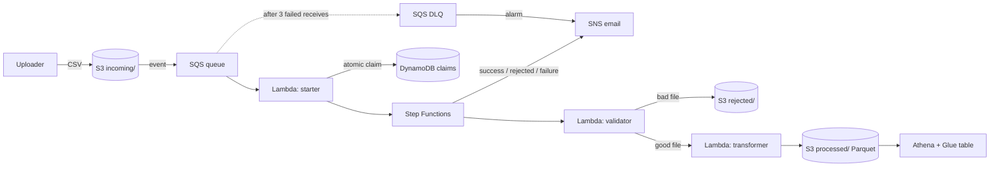
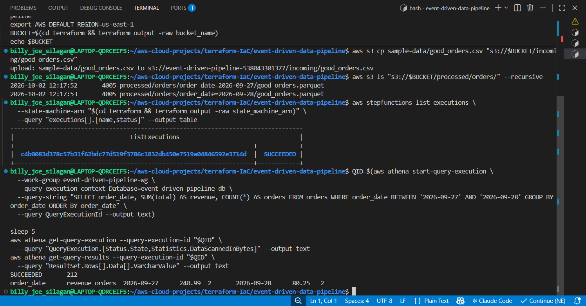
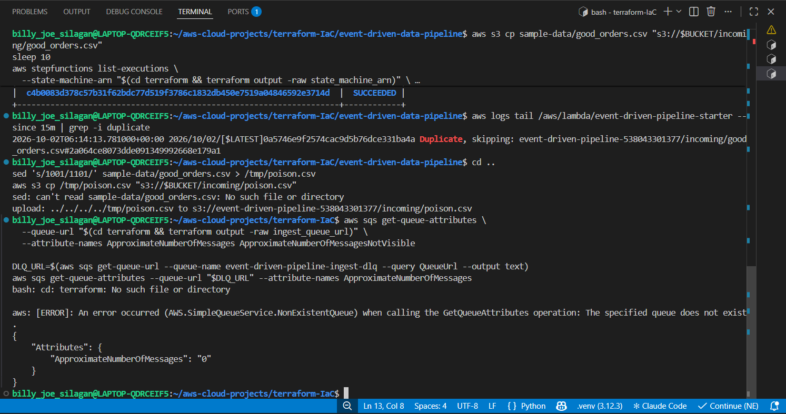
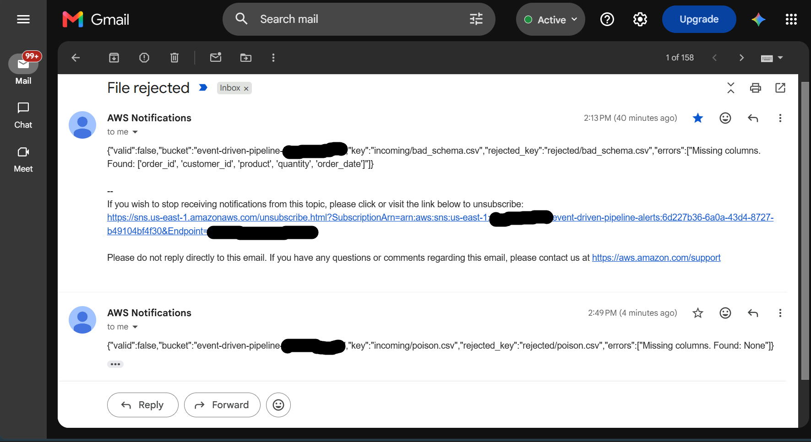
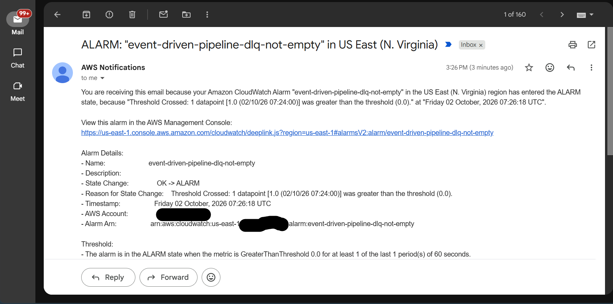
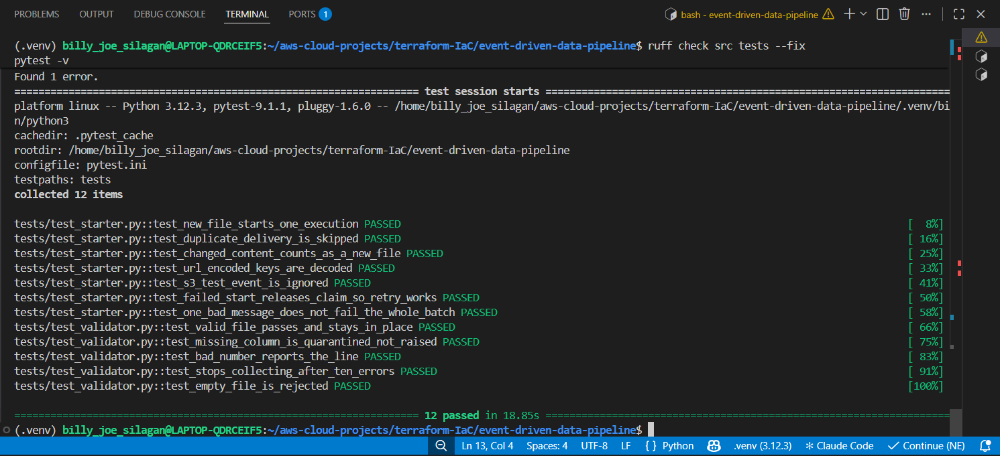

# Event-Driven Data Processing Pipeline (AWS)


A serverless pipeline that ingests CSV files from S3, deduplicates them, validates and
transforms them to partitioned Parquet, and exposes the result to SQL through Athena.
Built with Terraform, Python, and GitHub Actions (OIDC, no stored AWS keys), and
deliberately cost-optimized: a demo run typically costs well under $1/month.

**Stack:** S3 · SQS · Lambda (arm64) · Step Functions · DynamoDB · SNS · CloudWatch · Glue Catalog · Athena · Terraform · GitHub Actions · pytest/moto

## Architecture



## Real-world use case

Think of a retail chain where 200 stores upload a nightly `sales.csv`. The business needs
no lost files, bad files set aside without blocking others, no file ever counted twice, and
analysts querying results cheaply the next morning. The same shape appears in banking
(partner transaction files), healthcare (lab results), ad-tech (click logs), and logistics
(shipment scans).

## Demo vs. Production

| Area | This demo (cost-optimized) | Real production team |
|---|---|---|
| Event routing | S3 → SQS directly | S3 → **EventBridge** (fan-out, filtering, replay) |
| Compute | Lambda, 512 MB | Glue/Fargate for large files; Lambda aliases + canary deploys |
| Idempotency | DynamoDB claim + deterministic execution name | Same, via Powertools utility; defined dedup window |
| Orchestration | Step Functions Standard | Standard or Express by workload; X-Ray tracing |
| Schema | Static table + partition projection | Governed Glue catalog, Lake Formation, schema registry |
| Data quality | Header and numeric type checks | Great Expectations/Deequ, quality dashboards |
| Encryption | S3 default (SSE-S3) | **KMS customer-managed keys** across S3/SQS/SNS/DynamoDB |
| Networking | Lambdas outside a VPC | VPC-attached where required, VPC endpoints |
| Alerting | Email via SNS | PagerDuty/Slack, severities, on-call, runbooks |
| DLQ handling | Manual redrive | Automated redrive, DLQ-age alarm, runbook |
| Retention | 7/14/30-day expiry | Compliance-driven retention, Glacier tiering, versioning, Object Lock |
| Environments | One | dev/staging/prod in separate AWS accounts |
| Delivery | Auto-apply from `main` via OIDC | PR plan review, approvals, blocking policy checks |
| Access control | Role per function, exact ARNs | + permission boundaries, SCPs, Access Analyzer |
| Observability | Logs + 2 alarms | Structured logs, tracing, dashboards, SLOs |
| Cost | Budget alert, scan cap, retention | Tag-based allocation, per-team budgets, Savings Plans |
| Teardown | `force_destroy = true` | Never; versioning and deletion protection |

## Data flow (tracing `good_orders.csv`)

1. The file is uploaded to `incoming/`. S3 emits an event to SQS (only `.csv` under `incoming/`).
2. The **starter** Lambda reads the message, builds a file identity (`bucket/key#etag`), and
   attempts an atomic conditional write to DynamoDB. If the claim fails, the file is a duplicate and is skipped.
3. The starter starts a Step Functions execution (named by a hash of the file identity).
4. **Validate:** checks required columns and numeric fields. Bad files are moved to `rejected/`.
5. **Transform:** converts to Parquet, adds a `total` column, drops duplicate order IDs, and
   writes one file per date to `processed/orders/order_date=YYYY-MM-DD/`.
6. SNS emails the outcome. Analysts query the result in Athena.

## Design decisions

- **Why SQS between S3 and Lambda?** It buffers bursts, retries failures, and gives a DLQ to alarm on.
- **Why a DLQ?** Poison messages are isolated instead of retrying forever, and a non-empty DLQ is the clearest "a human is needed" signal.
- **Why Step Functions?** Visual run history, built-in retry/catch, and direct SNS integration with no glue code.
- **Why Parquet and date partitions?** Athena bills per byte scanned. Columns and folders cut what's read.
- **Why no Glue crawler?** Crawlers bill per DPU-hour. Partition projection costs nothing.
- **Why a claim table plus deterministic names?** SQS is at-least-once, so duplicates are normal. Three layers prevent double-counting: the DynamoDB claim, the execution name, and deterministic output filenames.
- **Why Lambda on arm64?** Lower per-millisecond price than x86 for this workload.

## Failure handling

| Failure | Type | What happens |
|---|---|---|
| Malformed CSV | **Expected** (business) | Moved to `rejected/`, "File rejected" email, execution **succeeds** |
| Duplicate upload | **Expected** | Skipped at the claim step, logged |
| Lambda throttle/timeout | Unexpected, transient | Step Functions retries with exponential backoff |
| Retries exhausted | Unexpected | `Catch` → failure email → execution `Failed` → alarm |
| Starter crashes | Unexpected | SQS retries 3× → DLQ → alarm email → manual redrive |

## Idempotency, and a bug I found

The first design wrote the DynamoDB claim *before* starting the workflow. If the claim succeeded
but `start_execution` failed, the retry saw "duplicate" and **silently dropped the file**.
Fix: a compensating action that releases the claim when the start fails, plus a deterministic
execution name as a second guard. A regression test covers it
(`test_failed_start_releases_claim_so_retry_works`).

## Screenshots from a live run

Captured from a real deployment in my AWS account.

### Happy path
Dropping `good_orders.csv` into `incoming/` starts one Step Functions execution and writes date-partitioned Parquet to `processed/`. The result is queryable in Athena right away.



### Duplicate delivery is skipped
The same file arriving twice is caught by a DynamoDB claims table, so no second execution starts.



### Bad files are quarantined and reported
A file with a missing column, or an empty file, is moved to `rejected/` and an SNS email says why.



### Failed messages trip an alarm
A message that can't be processed lands in the dead-letter queue. That trips the `event-driven-pipeline-dlq-not-empty` CloudWatch alarm, which emails me.



### Tests
12 tests cover the starter and validator Lambdas: dedup, partial batch failures, bad rows, and empty files.




## Test scenarios

| # | Scenario | Evidence |
|---|---|---|
| 1 | Happy path |  |
| 2 | Bad schema is quarantined |  |
| 3 | Duplicate is skipped |  |
| 4 | Poison message → DLQ → alarm |  |
| 5 | Burst of 200 files |  |

## Cost

| Guardrail | Effect |
|---|---|
| Lambda arm64 | Cheaper compute |
| 7-day log retention | Logs don't accumulate forever |
| S3 lifecycle rules | Data expires automatically |
| Athena 1 GB scan cap | Runaway queries are cancelled |
| No Glue crawler | No DPU-hour charges |
| DynamoDB on-demand + TTL | No idle capacity, self-cleaning |
| Step Functions Standard, `ERROR` logs | Free-tier friendly, minimal log volume |

Athena scan comparison (partition filter vs. none): 

> Verify current prices on the AWS pricing pages; free tiers change.

## Deploy

```bash
cd terraform
terraform init
terraform plan  -var="alert_email=you@example.com" -var="pandas_layer_arn=<arm64 layer ARN>"
terraform apply -var="alert_email=you@example.com" -var="pandas_layer_arn=<arm64 layer ARN>"
```

Then **click the confirmation link** in the SNS subscription email, or no alerts will arrive.
Run unit tests locally with `pip install -r requirements-dev.txt && pytest`.

## Teardown

```bash
cd terraform
terraform destroy   # force_destroy empties the demo bucket
```

## Lessons learned

- Hidden dependencies need `depends_on` (log delivery permissions, SQS trigger permissions).
- Expected failures (bad data) should be handled, not raised, or they pollute alarms.
- <add your own: errors you hit, how you debugged them>

## Future improvements

EventBridge for fan-out and replay · Kinesis for true streaming · Great Expectations for data quality ·
Parquet compaction job · KMS customer-managed keys · extracting transformer logic for unit testing
